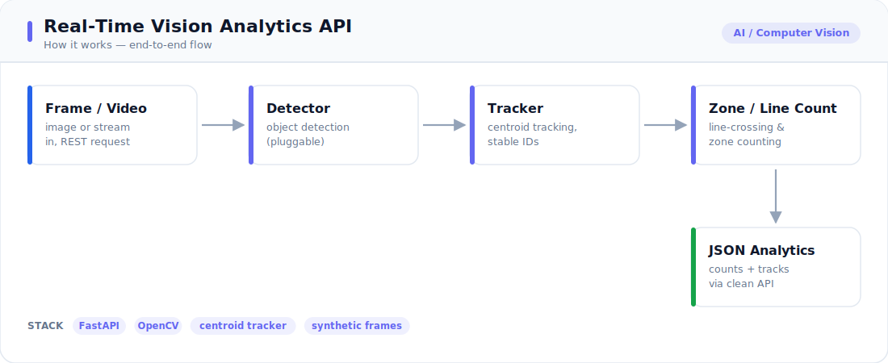

# 🎥 Real-Time Vision Analytics API

A production-style **computer-vision microservice** that detects, tracks, and
**counts objects crossing a virtual line** in a video stream — the core of
footfall counting, queue monitoring, and vehicle-flow analytics. It ships with a
deterministic synthetic scene generator so the whole thing runs **offline with no
model download and no dataset**, and exposes everything over a FastAPI HTTP API.

> Uses only **synthetic, generated frames** — no real footage, faces, or any
> personal/sensitive data.

---

<!-- portfolio-visuals -->

## 🔧 How it works



*End-to-end flow from input to output — see [`architecture.svg`](./architecture.svg).*

---


## What it does

- **Detect** bright objects per frame (classical OpenCV: threshold + contours).
- **Track** them across frames with a centroid tracker that assigns stable IDs.
- **Analyse** the stream: per-frame object counts, unique objects,
  **line-crossing counts** (left→right / right→left), and **region-of-interest
  (zone) analytics** — occupancy, peak occupancy, and per-object **dwell time**
  for queue-length / loitering use cases.
- Serve it all behind a small, typed **FastAPI** service.

Example pipeline output over a 60-frame synthetic clip with 4 moving objects (with
a zone configured over the middle of the frame):

```json
{
  "frames": 60,
  "unique_objects": 5,
  "max_objects_in_frame": 4,
  "avg_objects_per_frame": 3.42,
  "crossings_left_to_right": 3,
  "crossings_right_to_left": 0,
  "crossings_total": 3,
  "zone": {
    "peak_occupancy": 4,
    "current_occupancy": 0,
    "unique_visitors": 4,
    "max_dwell_frames": 21
  }
}
```

*(Reproducible with `python run_demo.py`. `unique_objects` slightly exceeds the
true count because two objects briefly overlap and the lightweight tracker
re-IDs one of them — a known, documented trade-off; see "Extensions".)*

## Architecture

```
 frame ─► Detector ──► detections ─► CentroidTracker ──► tracks (stable IDs)
        (Blob/ONNX)        │                                   │
                           ▼                                   ▼
                     /analyze (one shot)            LineCrossingCounter + counts
                                                              │
                                                     /analyze/sequence (summary)
```

Detector, tracker, and analytics are decoupled — the **`Detector` interface**
(`detect(frame) -> [Detection]`) means you can drop in a real model (YOLO/SSD via
ONNX Runtime) without touching tracking or analytics.

## API

| Method | Path | Purpose |
|--------|------|---------|
| `GET`  | `/health` | liveness + active detector |
| `GET`  | `/config` | effective settings |
| `POST` | `/analyze` | upload an image → detections + count |
| `POST` | `/analyze/sequence` | run detect→track→count over a synthetic clip → analytics summary |

```bash
# single image
curl -F "file=@frame.png" http://localhost:8000/analyze

# full pipeline over a generated clip
curl -X POST http://localhost:8000/analyze/sequence \
     -H "Content-Type: application/json" \
     -d '{"n_frames": 60, "n_objects": 4}'
```

## Tech stack

- **Vision:** OpenCV (headless), NumPy
- **Analytics:** line-crossing counter + **ROI zone occupancy & dwell** (`src/analytics.py`)
- **Serving:** FastAPI + Uvicorn (Pydantic models)
- **Optional model backend:** ONNX Runtime (set `DETECTOR=onnx`, `ONNX_MODEL_PATH`)
- **Observability:** structured logging via `src/logging_utils.py` (`LOG_LEVEL` env)
- **Deploy:** `Dockerfile` + `docker-compose.yml`; GitHub Actions CI runs the suite
- **Tests:** pytest (25 tests, incl. a FastAPI-free pipeline test and zone/dwell checks)

## Setup & run

```bash
cd 03-realtime-vision-analytics-api
python -m venv .venv && source .venv/bin/activate   # Windows: .venv\Scripts\activate
pip install -r requirements.txt

python run_demo.py                  # run pipeline, print analytics, save annotated frames
uvicorn src.api:app --reload        # start the API at http://localhost:8000/docs
pytest -q                           # run tests
```

Open `http://localhost:8000/docs` for the interactive Swagger UI.

## Project structure

```
03-realtime-vision-analytics-api/
├── run_demo.py             # offline pipeline demo + annotated frames
├── src/
│   ├── config.py           # typed settings from .env
│   ├── synthetic.py        # deterministic moving-object scene generator
│   ├── detection.py        # Detector interface: BlobDetector (+ OnnxDetector hook)
│   ├── tracking.py         # CentroidTracker (stable IDs across frames)
│   ├── analytics.py        # line-crossing counter + ROI zone/dwell + summary
│   ├── pipeline.py         # detect → track → analyse
│   ├── logging_utils.py    # structured logging + timing
│   └── api.py              # FastAPI service
├── tests/                  # 25 pytest tests
├── Dockerfile              # containerised FastAPI service
├── docker-compose.yml
├── .github/workflows/ci.yml
├── .env.example
├── requirements.txt
└── .gitignore
```

## Possible extensions

- **Learned detector:** plug a YOLO/SSD model in via the `OnnxDetector` stub for
  real-world classes (people, vehicles) instead of bright blobs.
- **Robust tracking:** Kalman-filter + IoU/Re-ID matching (SORT/DeepSORT) to stop
  ID switches when objects overlap.
- **Multi-zone analytics:** dwell time, zone occupancy, and directional flow maps.
- **Streaming:** WebSocket/RTSP ingestion with frame batching for true real-time.
- **Observability:** Prometheus metrics (FPS, latency, counts) and a Grafana board.
```
